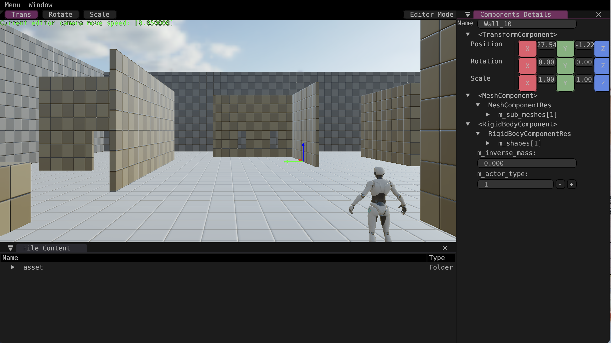

# Mini_Engine

一个基于 **C++** 与 **Vulkan** 自研的轻量级游戏引擎，参考 **Unreal Engine 4 (UE4)** 架构设计。  
实现模块化渲染管线、资源系统、动画与物理模块，支持 **Tiled-based 延迟渲染**、**PBR 材质**、**LUT 后处理** 及基于 **Jolt Physics** 的刚体模拟与碰撞检测。  
内置 **ImGui 编辑器** 与 **Lua 脚本系统**，支持资源加载与对象属性实时编辑。

---

## 功能特性

### 核心框架
- 模块化架构与资源管理系统  
- 反射与序列化机制  
- 类 ECS 的组件化设计  

### 渲染系统
- 基于 **Vulkan** 的多阶段渲染管线  
- **Tiled-based 延迟渲染** 与光源分区计算  
- **PBR 材质**、**IBL 环境光照**、**HDR 渲染**  
- **LUT 色调映射** 与 **Gamma 矫正** 后处理   

### 动画系统
- 骨骼蒙皮动画 
- 支持多动画混合与权重控制  
- 层级骨骼矩阵与蒙皮绑定计算  

### 物理系统
- 集成 **Jolt Physics** 实现刚体模拟  
- 支持碰撞检测与约束  
- 动画与物理系统可联动实现动态交互  

### 编辑器与脚本系统
- 内置 **ImGui 编辑器**
  - 可视化场景浏览  
  - 对象属性实时修改  
- 集成 **Lua 脚本系统**
  - 运行时脚本扩展  

### 补充
- Vulkan实现的 **PBD 布料模拟**
  
